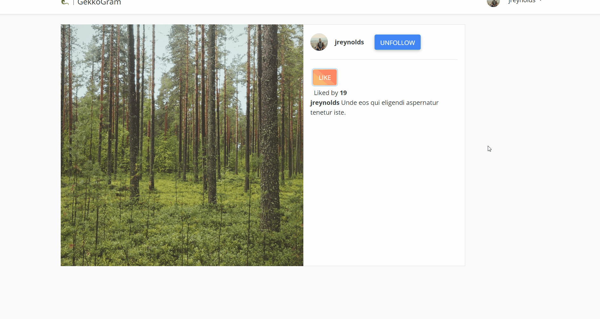

# Getting started

## Showcase

You can find all images at: https://imgur.com/a/mHgP5IB
## Installation

Please check the official laravel installation guide for server requirements before you start. [Official Documentation](https://laravel.com/docs/5.4/installation#installation)

Clone the repository

    git clone git@github.com:alexander-gekov/gekko-gram.git

Switch to the repo folder

    cd gekko-gram

Install all the dependencies using composer

    composer install

Copy the example env file and make the required configuration changes in the .env file

    cp .env.example .env

Generate a new application key

    php artisan key:generate
	
Create a storage link

	php artisan storage:link
	
Migrate databases

	php artisan migrate:fresh

Start the local development server

    php artisan serve

You can now access the server at http://localhost:8000
